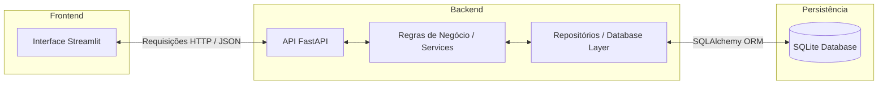
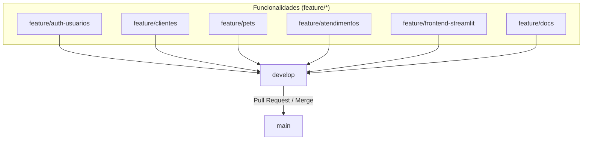

# 🐾 MedPet — Sistema Web de Gestão para Clínica Veterinária

Projeto desenvolvido para a disciplina **Análise e Projeto de Sistemas (APS)**, com o objetivo de construir um sistema web simples, funcional e bem estruturado para auxiliar na gestão básica de uma clínica veterinária.

O sistema é construído com **FastAPI** no backend e **Streamlit** no frontend, seguindo a proposta de criar uma aplicação web completa contendo API, interface, banco de dados, documentação e organização baseada em boas práticas de Engenharia de Software.

---

## 📌 Sobre o Projeto

O **MedPet** tem como finalidade centralizar informações importantes de uma clínica veterinária, reduzindo controles manuais e facilitando o cadastro, consulta e organização de dados de clientes, pets e atendimentos.

Nesta primeira versão, o foco será entregar um sistema básico, coerente com o escopo acadêmico, contendo as funcionalidades essenciais para apresentação e validação do projeto.

---

## 🎯 Objetivo

Desenvolver uma aplicação web para gestão veterinária que permita:

- Cadastrar e consultar clientes;
- Cadastrar pets vinculados aos seus tutores;
- Registrar atendimentos veterinários;
- Organizar informações básicas da clínica;
- Demonstrar integração entre frontend, backend e banco de dados;
- Aplicar conceitos de Engenharia de Software, UML e padrões de projeto.

---

## 👥 Público-Alvo

O sistema é destinado a pequenas clínicas veterinárias, atendentes, veterinários e administradores que precisam organizar dados de clientes, animais e atendimentos de forma simples e centralizada.

---

## 👤 Perfis de Usuário

* **Administrador**: Responsável por gerenciar o sistema, visualizar dados gerais e manter os cadastros principais.
* **Atendente**: Responsável por cadastrar clientes, pets e consultar informações básicas.
* **Veterinário**: Responsável por registrar atendimentos, histórico clínico e observações sobre os pets.

---

## ✅ Funcionalidades do Sistema

### Clientes
- Cadastro de clientes/tutores;
- Listagem de clientes cadastrados;
- Atualização de dados cadastrais;
- Remoção de clientes, quando necessário.

### Pets
- Cadastro de pets;
- Associação de pets aos seus respectivos tutores;
- Consulta de informações como nome, espécie, raça, idade e observações;
- Atualização e exclusão de registros.

### Atendimentos
- Registro de atendimentos veterinários;
- Histórico de atendimentos por pet;
- Descrição do motivo da consulta;
- Observações clínicas básicas;
- Data do atendimento.

### Usuários e Autenticação
- Cadastro de usuários do sistema;
- Login com autenticação;
- Controle básico de acesso por perfil.

### Relatórios Simples
- Consulta de clientes cadastrados;
- Consulta de pets por tutor;
- Consulta de atendimentos registrados.

---

## 🧱 Tecnologias Utilizadas


- **Python** — Linguagem principal do projeto;
- **FastAPI** — Criação da API REST do backend;
- **Streamlit** — Construção da interface web (frontend);
- **SQLAlchemy** — ORM para comunicação com o banco de dados;
- **SQLite** — Banco de dados local para persistência de dados;
- **Pydantic** — Validação de schemas e dados na API;
- **Pytest** — Testes automatizados;
- **JWT** — Autenticação e controle de segurança;
- **Docker / Docker Compose** — Containerização e facilidade no setup;
- **Git/GitHub** — Versionamento de código.

---

## 🏗️ Arquitetura do Sistema

O projeto é dividido em três camadas principais:

1. **Frontend**: Interface web em Streamlit para visualização de telas, formulários e tabelas.
2. **Backend**: API REST em FastAPI contendo as regras de negócio, autenticação e rotas.
3. **Banco de Dados**: SQLite gerenciado via SQLAlchemy ORM para persistência dos dados.



---

## 📂 Estrutura do Projeto

```text
MedPet/
│
├── backend/                  # API REST com FastAPI
│   ├── app/
│   │   ├── core/             # Configurações globais e segurança
│   │   │   ├── config.py
│   │   │   ├── security.py
│   │   │   └── dependencies.py
│   │   ├── models/           # Entidades do SQLAlchemy (Tabelas)
│   │   │   ├── atendimento.py
│   │   │   ├── cliente.py
│   │   │   ├── pet.py
│   │   │   └── usuario.py
│   │   ├── repositories/     # Lógica de persistência e acesso ao DB
│   │   │   ├── atendimento_repository.py
│   │   │   ├── cliente_repository.py
│   │   │   ├── pet_repository.py
│   │   │   └── usuario_repository.py
│   │   ├── routes/           # Endpoints HTTP da API (Controllers)
│   │   │   ├── auth_routes.py
│   │   │   ├── atendimento_routes.py
│   │   │   ├── cliente_routes.py
│   │   │   ├── pet_routes.py
│   │   │   └── usuario_routes.py
│   │   ├── schemas/          # Schemas do Pydantic (Validação e I/O)
│   │   │   ├── auth_schema.py
│   │   │   ├── atendimento_schema.py
│   │   │   ├── cliente_schema.py
│   │   │   ├── pet_schema.py
│   │   │   └── usuario_schema.py
│   │   ├── services/         # Camada de Regras de Negócio
│   │   │   ├── auth_service.py
│   │   │   ├── atendimento_service.py
│   │   │   ├── cliente_service.py
│   │   │   ├── pet_service.py
│   │   │   └── usuario_service.py
│   │   ├── database.py       # Configuração e sessão do banco de dados
│   │   └── main.py           # Inicialização e ponto de partida do backend
│   │
│   ├── scripts/              # Scripts auxiliares (Povoamento / Seeds)
│   │   └── seed.py
│   │
│   ├── Dockerfile            # Configuração Docker para o Backend
│   └── requirements.txt      # Dependências do backend
│
├── frontend/                 # Interface Web com Streamlit
│   ├── app.py                # Ponto de entrada do Frontend
│   ├── Dockerfile            # Configuração Docker para o Frontend
│   └── requirements.txt      # Dependências do frontend
│
├── tests/                    # Testes automatizados do sistema
│   ├── conftest.py           # Fixtures e configurações globais do Pytest
│   ├── api/                  # Testes de rotas e integração da API
│   ├── ui/                   # Testes de componentes de UI
│   └── unit/                 # Testes de lógica de negócio isolada
│
├── docs/                     # Documentos de modelagem, UML e requisitos
│   ├── diagramas/            # Imagens e arquivos de modelagem UML
│   ├── casos-de-uso.md
│   ├── requisitos.md
│   └── roteiro-apresentacao.md
│
├── .github/                  # CI/CD (GitHub Actions)
│   └── workflows/
│       └── ci.yml            # Testes e validações automáticas no Push/PR
│
├── .env.example              # Exemplo de variáveis de ambiente do projeto
├── .gitignore                # Arquivos ignorados pelo controle de versão
├── docker-compose.yml        # Orquestração simplificada dos containers
├── requirements-dev.txt      # Ferramentas auxiliares de desenvolvimento
└── README.md                 # Documentação principal
```

---

## 🔗 Principais Endpoints da API

### Autenticação
* `POST /auth/register` — Cadastro de novos usuários.
* `POST /auth/login` — Login do usuário para obtenção do Token JWT.

### Clientes (Tutores)
* `GET /clientes` — Listagem de todos os clientes.
* `POST /clientes` — Criação de um novo cliente.
* `GET /clientes/{id}` — Detalhes de um cliente específico.
* `PUT /clientes/{id}` — Atualização cadastral de cliente.
* `DELETE /clientes/{id}` — Exclusão de um cliente.

### Pets
* `GET /pets` — Listagem de todos os pets cadastrados.
* `POST /pets` — Cadastro de um pet associado a um tutor (cliente).
* `GET /pets/{id}` — Consulta de detalhes de um pet.
* `PUT /pets/{id}` — Atualização dos dados de um pet.
* `DELETE /pets/{id}` — Exclusão de um pet.

### Atendimentos
* `GET /atendimentos` — Listagem de atendimentos.
* `POST /atendimentos` — Registro de um atendimento associado a um pet.
* `GET /atendimentos/{id}` — Consulta detalhada de atendimento.
* `PUT /atendimentos/{id}` — Atualização de observações clínicas.
* `DELETE /atendimentos/{id}` — Exclusão de atendimento.

> [!TIP]
> Com a API rodando, você pode acessar a interface interativa do Swagger em: `http://localhost:8000/docs`.

---

## 🧩 Padrões de Projeto Aplicados

* **MVC Adaptado (Model-View-Controller)**: Separação clara entre a interface visual (View), lógica de rotas/endpoints (Controller), validações/negócio (Service) e estruturas de dados (Model).
* **Repository Pattern**: Abstração do acesso ao banco de dados para simplificar testes e isolar as operações do SQLAlchemy.
* **Service Layer**: Concentração de todas as regras de negócio e validações, deixando as rotas focadas apenas em tratar a requisição e a resposta HTTP.

---

## 🧪 Testes

### Testes Manuais
* Validação dos endpoints usando a documentação gerada pelo Swagger;
* Verificação visual de fluxos de telas no Streamlit;
* Testes pontuais de exclusão e edição de relacionamentos.

### Testes Automatizados
* Utilização do **Pytest** para validar os cenários e fluxos da API de forma isolada;
* Verificação de tratamentos de erro (ex: requisições sem tokens, exclusões inválidas, validação de campos obrigatórios).

#### Tabela de Casos de Teste Principais

| ID | Cenário de Teste | Resultado Esperado |
|---|---|---|
| **CT01** | Autenticação com credenciais válidas | Retorno de Token JWT com sucesso |
| **CT02** | Cadastro de novo cliente/tutor | Registro gravado no banco de dados e ID gerado |
| **CT03** | Cadastro de pet sem fornecer ID do tutor | Retorno de erro HTTP 400 ou correspondente |
| **CT04** | Consulta de histórico de atendimentos | Retorno de lista de atendimentos válida |

---

## ▶️ Como Executar o Projeto

Você pode rodar o MedPet localmente de três formas diferentes: usando **Docker Compose**, criando um **Ambiente Virtual (venv)** ou fazendo a **Instalação Direta** das dependências.

> [!IMPORTANT]
> Antes de começar, renomeie o arquivo `.env.example` na raiz do projeto para `.env` e ajuste as variáveis de ambiente, caso necessário.

### Método A: Utilizando Docker Compose (Mais Rápido 🚀)

Caso tenha o Docker instalado na máquina, basta subir os serviços com um único comando na raiz do projeto:

```bash
docker-compose up --build
```

* **Frontend (Streamlit):** Acesse `http://localhost:8501`
* **Backend (FastAPI):** Acesse `http://localhost:8000`
* **Documentação interativa (Swagger):** Acesse `http://localhost:8000/docs`

---

### Método B: Utilizando Ambiente Virtual Python (Recomendado 🐍)

Este método isola os pacotes para evitar conflitos na sua máquina.

1. **Clone o repositório:**
   ```bash
   git clone https://github.com/GuiCodeLabs/MedPet.git
   cd MedPet
   ```

2. **Crie e ative o ambiente virtual:**
   * **No Windows (PowerShell):**
     ```powershell
     python -m venv .venv
     .\.venv\Scripts\Activate.ps1
     ```
   * **No Linux/macOS:**
     ```bash
     python3 -m venv .venv
     source .venv/bin/activate
     ```

3. **Instale as dependências:**
   ```bash
   pip install --upgrade pip
   pip install -r backend/requirements.txt
   pip install -r frontend/requirements.txt
   pip install -r requirements-dev.txt
   ```

4. **Execute o Backend (FastAPI):**
   ```bash
   cd backend
   uvicorn app.main:app --reload
   ```
   *(Mantenha este terminal rodando e abra outro)*

5. **Execute o Frontend (Streamlit):**
   *(Ative o ambiente virtual no novo terminal antes de rodar)*
   ```bash
   cd frontend
   streamlit run app.py
   ```

---

### Método C: Instalação Direta (Sem Ambiente Virtual)

Se preferir não usar o ambiente virtual, siga os passos abaixo:

1. **Instale as dependências diretamente:**
   ```bash
   pip install -r backend/requirements.txt
   pip install -r frontend/requirements.txt
   ```

2. **Inicialize o Backend:**
   ```bash
   cd backend
   uvicorn app.main:app --reload
   ```

3. **Inicialize o Frontend (em outro terminal):**
   ```bash
   cd frontend
   streamlit run app.py
   ```

---

## 👥 Divisão de Responsabilidades

A divisão abaixo segue a organização das branches definida para o projeto. Cada integrante deve desenvolver sua parte na branch correspondente, enviar as alterações para o repositório remoto e abrir Pull Request para integração na `develop`. Após validação, a versão estável será integrada na `main`.

| Integrante | GitHub | Branch principal | Funcionalidade/Módulo | Responsabilidades |
|---|---|---|---|---|
| Pedro Antonio Braz da Silva | [Pedro-Brazz](https://github.com/Pedro-Brazz) | `feature/auth-usuarios` | Autenticação e usuários | Implementar cadastro de usuários, login, autenticação com JWT, hash de senha, controle básico de acesso por perfil, validações de usuário e estrutura de `models`, `schemas`, `routes`, `services` e `repositories` relacionadas a autenticação e usuários. |
| Pedro Henrique Paiva Barros | [Pedro-hxm](https://github.com/Pedro-hxm) | `feature/clientes` e `feature/pets` | Clientes e pets | Implementar CRUD de clientes/tutores, CRUD de pets, associação de pets aos seus respectivos tutores, validações de cadastro, consulta de pets por cliente e endpoints necessários para listagem, atualização e exclusão desses registros. |
| Arllan Leopoldino Nunes | [LanNunez](https://github.com/LanNunez) | `feature/atendimentos` | Atendimentos veterinários | Implementar registro de atendimentos, histórico de atendimentos por pet, descrição do motivo da consulta, observações clínicas, data do atendimento, validação de pet existente e endpoints de criação, consulta, atualização e exclusão de atendimentos. |
| Guilherme Cavalcante Beserra | [GuiCodeLabs](https://github.com/GuiCodeLabs) | `feature/frontend-streamlit` e `feature/docs` | Frontend e documentação | Desenvolver a interface web em Streamlit, criar telas e formulários para autenticação, clientes, pets e atendimentos, consumir a API FastAPI via HTTP/JSON, organizar a documentação do projeto, atualizar o README, estruturar materiais em `docs/` e apoiar a integração final na `develop` e na `main`. |

### Fluxo de integração das branches



- Cada integrante trabalha em sua própria branch de funcionalidade;
- As branches de funcionalidade devem ser integradas primeiro na `develop`;
- A branch `develop` concentra a versão em testes e integração;
- A branch `main` recebe apenas a versão final, estável e revisada do projeto.

---

## 📄 Documentação do Projeto

A documentação detalhada do projeto está organizada na pasta `docs/`.

| Documento | Descrição |
|---|---|
| [`requisitos.md`](docs/requisitos.md) | Apresenta os requisitos funcionais, não funcionais, regras de negócio e entidades principais do sistema. |
| [`casos-de-uso.md`](docs/casos-de-uso.md) | Descreve os atores do sistema, casos de uso e fluxos principais. |
| [`roteiro-apresentacao.md`](docs/roteiro-apresentacao.md) | Contém o roteiro resumido para a apresentação do projeto. |
| `diagramas/` | Pasta destinada aos diagramas UML do sistema. |

---

## 🚀 Roadmap

### Versão Inicial
- [x] Definição do tema do projeto;
- [x] Definição do escopo básico;
- [x] Estruturação do README;
- [ ] Criação dos diagramas UML;
- [ ] Implementação do backend;
- [ ] Implementação do frontend;
- [ ] Integração entre API e interface;
- [ ] Testes básicos;
- [ ] Deploy ou demonstração local.

### Melhorias Futuras
- [ ] Controle de estoque de medicamentos;
- [ ] Controle de vacinas;
- [ ] Relatórios avançados;
- [ ] Módulo financeiro;
- [ ] Notificações para tutores;
- [ ] Integração com WhatsApp;
- [ ] Deploy em nuvem.

---

## 📚 Referências

- [FastAPI Documentation](https://fastapi.tiangolo.com/)
- [Streamlit Documentation](https://docs.streamlit.io/)
- [SQLAlchemy ORM Documentation](https://docs.sqlalchemy.org/)
- Material da disciplina de Análise e Projeto de Sistemas;
- Conceitos de UML e Engenharia de Software.

---

## 👥 Equipe

Projeto desenvolvido por:

- Guilherme Cavalcante;
- Arllan Leopoldino;
- Pedro Henrique;
- Pedro Antonio.

---

## 📌 Status do Projeto

🚧 Em fase de planejamento e estruturação do escopo.

---

## 🐾 MedPet

Sistema simples, organizado e funcional para apoiar a gestão básica de uma clínica veterinária.
