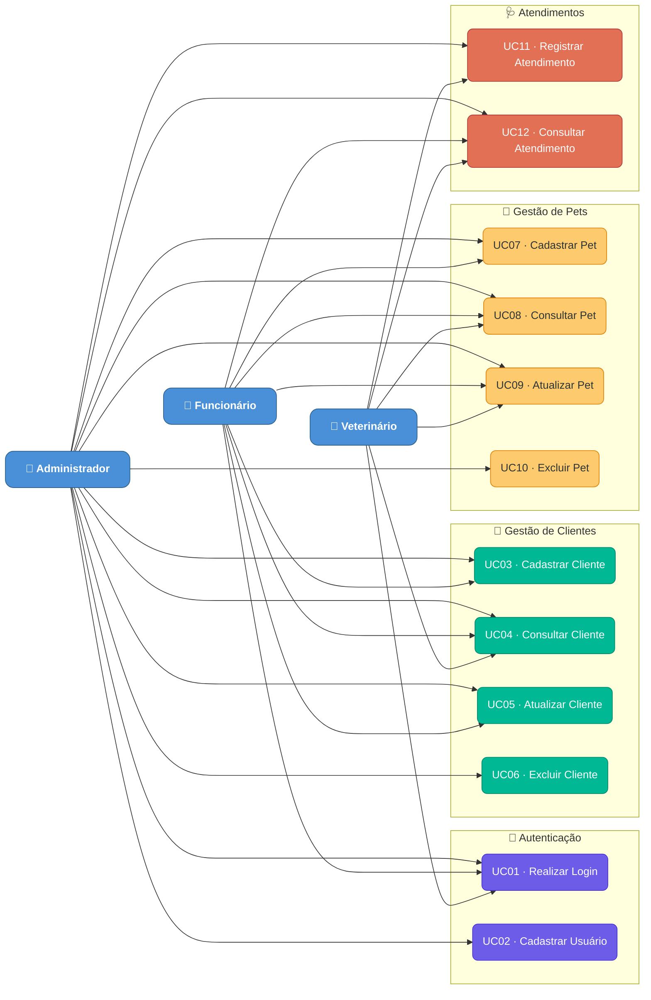
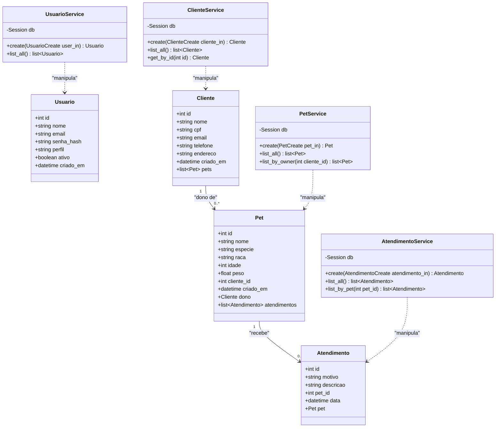
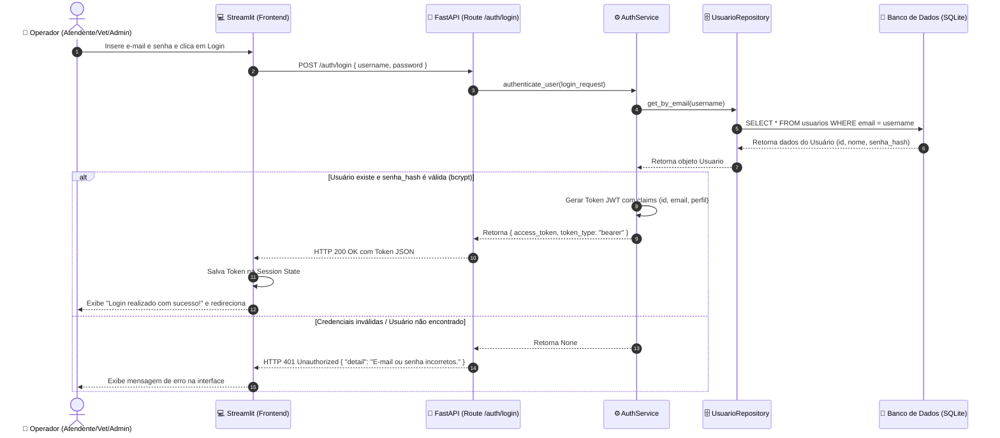
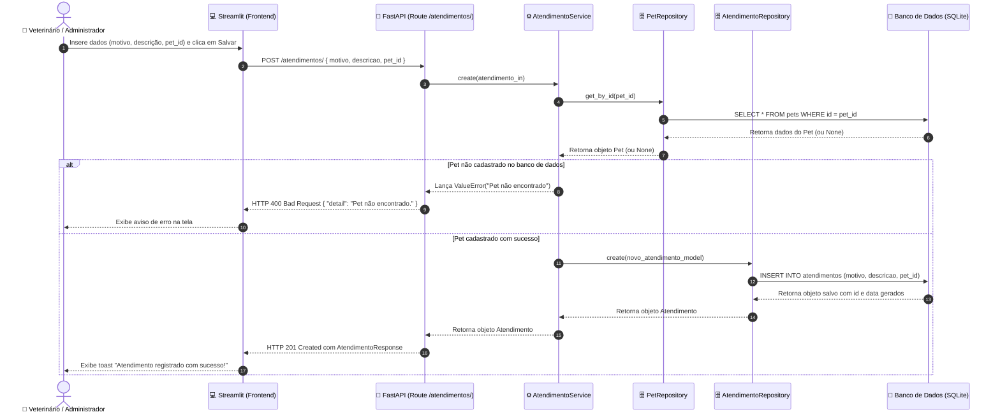
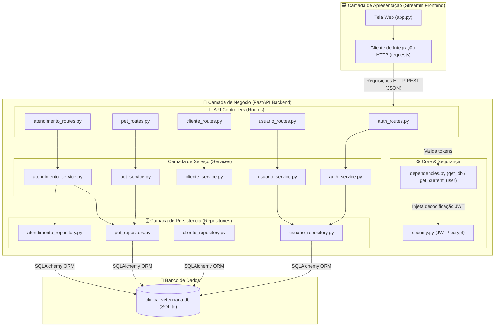
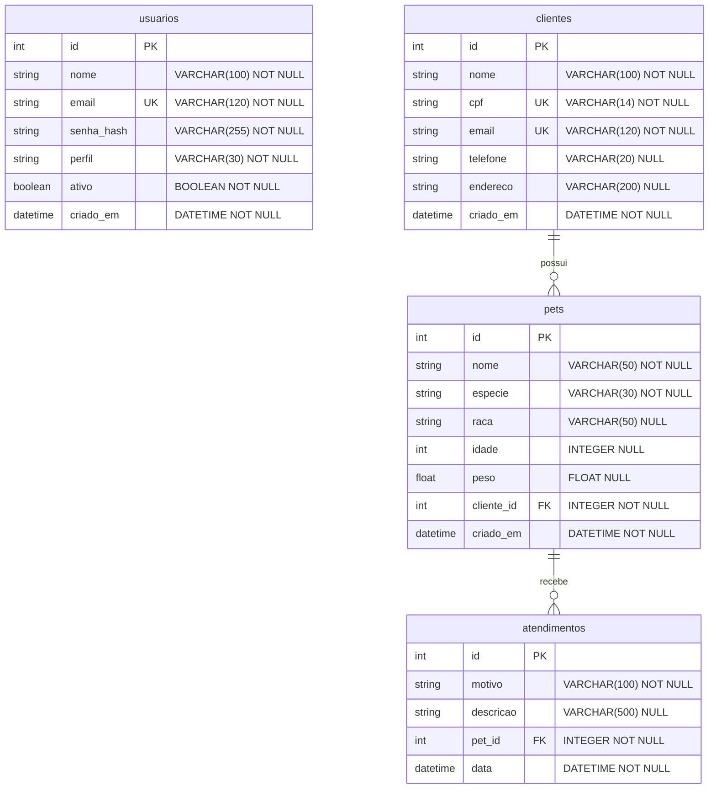

# 📂 Documentação do Sistema — MedPet

Bem-vindo à documentação oficial do **MedPet**! Este diretório centraliza todas as especificações, modelos, roteiros e arquiteturas relativos ao sistema de gestão de clínica veterinária.

O objetivo desta documentação é facilitar a compreensão do sistema, o desenvolvimento de novas funcionalidades, a manutenção do código e a preparação para a apresentação acadêmica e prática do projeto.

> [!TIP]
> **Como visualizar os diagramas localmente:**
> Se você estiver usando o **VS Code**, instale a extensão **Markdown Preview Mermaid Support** ou **Mermaid Preview** para renderizar os diagramas UML diretamente na visualização do Markdown (`Ctrl + Shift + V`). Eles também são renderizados de forma nativa no GitHub.

---

## 🗺️ Mapa da Documentação

Para navegar entre os documentos detalhados de cada tópico do sistema, utilize o índice abaixo:

| Documento | Descrição |
| :--- | :--- |
| [📋 Requisitos](requisitos.md) | Lista de requisitos funcionais (RFs), requisitos não funcionais (RNFs) e regras de negócio (RNs) do sistema. |
| [👥 Casos de Uso](casos-de-uso.md) | Detalhamento dos atores, casos de uso (UCs) e fluxos de interação com o sistema. |
| [🏗️ Arquitetura](arquitetura.md) | Descrição das camadas do sistema (Frontend, Backend, Database) e padrões de projeto aplicados. |
| [🗄️ Modelo de Dados](modelo-dados.md) | Estruturação e detalhes físicos das tabelas do banco de dados relacional (SQLite). |
| [🔌 Documentação da API](api.md) | Lista de endpoints expostos pelo backend, parâmetros de requisição e modelos de resposta. |
| [🧪 Estratégia de Testes](testes.md) | Organização de testes automatizados (Pytest) e instruções para execução. |
| [⚙️ Integração Contínua (CI/CD)](ci-cd.md) | Funcionamento da automação de testes e checagem de código com GitHub Actions. |
| [🎤 Roteiro de Apresentação](roteiro-apresentacao.md) | Guia estruturado para apresentação e validação acadêmica do projeto. |
| [🎨 Diagramas (Pasta)](diagramas/) | Pasta física que armazena os arquivos-fonte `.mmd` dos diagramas UML de modelagem. |

---

## 📊 Matriz de Artefatos UML e Modelagem

Esta tabela sumariza todos os diagramas disponíveis para o sistema, indicando o tipo de modelagem e seu foco:

| Código | Diagrama | Tipo | Foco Principal | Arquivo de Origem |
| :---: | :--- | :--- | :--- | :--- |
| **UML-01** | [Casos de Uso](#1-diagrama-de-casos-de-uso) | Comportamental | Relação dos atores com as funcionalidades do sistema | [diagrama-casos-de-uso.mmd](diagramas/mermaids/diagrama-casos-de-uso.mmd) |
| **UML-02** | [Diagrama de Classes](#2-diagrama-de-classes) | Estrutural | Estruturação lógica e assinaturas das classes e entidades | [diagrama-classes.mmd](diagramas/mermaids/diagrama-classes.mmd) |
| **UML-03** | [Sequência (Login)](#3-diagrama-de-sequência---login) | Comportamental/Interação | Fluxo temporal e autenticação baseada em tokens JWT | [diagrama-sequencia-login.mmd](diagramas/mermaids/diagrama-sequencia-login.mmd) |
| **UML-04** | [Sequência (Atendimento)](#4-diagrama-de-sequência---registro-de-atendimento) | Comportamental/Interação | Passos para persistência e validação de consultas clínicas | [diagrama-sequencia-atendimento.mmd](diagramas/mermaids/diagrama-sequencia-atendimento.mmd) |
| **UML-05** | [Diagrama de Atividades](#5-diagrama-de-atividades) | Comportamental | Fluxo de processos de negócio de check-in e triagem de pets | [diagrama-atividades.mmd](diagramas/mermaids/diagrama-atividades.mmd) |
| **UML-06** | [Componentes](#6-diagrama-de-componentes) | Estrutural | Camadas físicas e dependências lógicas (Streamlit / FastAPI / DB) | [diagrama-componentes.mmd](diagramas/mermaids/diagrama-componentes.mmd) |
| **UML-07** | [Modelo Relacional (ERD)](#7-diagrama-de-entidade-relacionamento-erd) | Estrutural (Dados) | Modelagem física das tabelas SQLite e chaves PK/FK | [diagrama-entidade-relacionamento.mmd](diagramas/mermaids/diagrama-entidade-relacionamento.mmd) |

---

## 🛠️ Como contribuir para a Documentação e Diagramas

Para manter a consistência da documentação do MedPet, siga as diretrizes abaixo:

1. **Clareza e Precisão**: Use termos claros e padronizados conforme o domínio (ex: tutor/cliente, pet, atendimento).
2. **Sincronização com o Código**: Sempre que houver mudanças em modelos do banco de dados, endpoints de rotas ou regras de negócio, os arquivos Markdown correspondentes nesta pasta devem ser atualizados.
3. **Padrão dos Diagramas**:
   - Salve novos diagramas na pasta `diagramas/mermaids/` com a extensão `.mmd`.
   - Lembre-se de atualizar tanto o arquivo `.mmd` isolado quanto o bloco inline embutido neste `README.md`.
4. **Boas Práticas de Sintaxe Mermaid**:
   - > [!WARNING]
     > **Atenção aos parênteses:** Parênteses contidos em labels de conexões como `Client -->|Requisições (JSON)| Routes` causam erros de parsing no Mermaid, pois o parser os confunde com a sintaxe de formato dos nós (nós arredondados). Sempre utilize aspas duplas nas labels se houver caracteres especiais ou parênteses, por exemplo: `Client -->|"Requisições (JSON)"| Routes`.

---

---

## 📊 Diagramas Visuais do Sistema (UML e Modelagem)

Esta seção exibe a renderização em tempo real de todos os diagramas do **MedPet** utilizando sintaxe Mermaid. Você também pode acessar e editar os arquivos de código-fonte originais clicando nos links fornecidos.

### 👥 1. Diagrama de Casos de Uso
Descreve as interações dos atores (Administrador, Funcionário e Veterinário) com as funcionalidades centrais do sistema.
> 🔗 **Fonte:** [diagrama-casos-de-uso.mmd](diagramas/mermaids/diagrama-casos-de-uso.mmd)

---

### 🧱 2. Diagrama de Classes
Apresenta o mapeamento estático das entidades de modelo (Usuario, Cliente, Pet, Atendimento) e a estrutura lógica das classes de serviço.
> 🔗 **Fonte:** [diagrama-classes.mmd](diagramas/mermaids/diagrama-classes.mmd)

---

### 🔑 3. Diagrama de Sequência — Login
Ilustra a troca de mensagens na autenticação do operador (Atendente/Vet/Admin), com hash de senhas e geração de Token JWT.
> 🔗 **Fonte:** [diagrama-sequencia-login.mmd](diagramas/mermaids/diagrama-sequencia-login.mmd)

---

### 🩺 4. Diagrama de Sequência — Registro de Atendimento
Exibe o fluxo completo de registro de consulta veterinária, com verificações de consistência cadastral do animal.
> 🔗 **Fonte:** [diagrama-sequencia-atendimento.mmd](diagramas/mermaids/diagrama-sequencia-atendimento.mmd)

---

### 🔄 5. Diagrama de Atividades
Representa o fluxo lógico de negócio na clínica veterinária para o check-in de tutores, cadastro de animais e registro de consultas.
> 🔗 **Fonte:** [diagrama-atividades.mmd](diagramas/mermaids/diagrama-atividades.mmd)

```mermaid
stateDiagram-v2
    [*] --> Recepcao

    state Recepcao {
        [*] --> ReceberCliente : Receber Cliente e Pet na recepção
        ReceberCliente --> VerificarTutor : Verificar se Tutor (Cliente) já possui cadastro
    }

    state VerificarTutor <<choice>>
    VerificarTutor --> CadastrarTutor : Não
    VerificarTutor --> VerificarPet : Sim

    state CadastrarTutor {
        [*] --> FormTutor : Preencher Nome, CPF, E-mail, Telefone e Endereço
        FormTutor --> SalvarTutorAPI : Enviar POST /clientes/
        SalvarTutorAPI --> TutorCadastrado : Retorno 201 Created do Backend
    }

    TutorCadastrado --> VerificarPet

    state VerificarPet <<choice>>
    VerificarPet --> CadastrarPet : Não
    VerificarPet --> RegistrarAtendimento : Sim

    state CadastrarPet {
        [*] --> FormPet : Preencher Nome, Espécie, Raça, Idade e Peso
        FormPet --> AssociarTutor : Vincular ao ID do Tutor cadastrado
        AssociarTutor --> SalvarPetAPI : Enviar POST /pets/
        SalvarPetAPI --> PetCadastrado : Retorno 201 Created do Backend
    }

    PetCadastrado --> RegistrarAtendimento

    state RegistrarAtendimento {
        [*] --> FormAtendimento : Informar Motivo (Consulta/Vacina) e Observações Clínicas
        FormAtendimento --> VincularPet : Vincular ao ID do Pet selecionado
        VincularPet --> SalvarAtendimentoAPI : Enviar POST /atendimentos/
        SalvarAtendimentoAPI --> AtendimentoRegistrado : Retorno 201 Created do Backend
    }

    AtendimentoRegistrado --> [*]
```

---

### 📦 6. Diagrama de Componentes
Demonstra a arquitetura lógica em camadas da nossa stack unificada em Python.
> 🔗 **Fonte:** [diagrama-componentes.mmd](diagramas/mermaids/diagrama-componentes.mmd)

---

### 🗄️ 7. Diagrama de Entidade-Relacionamento (ERD)
Representa o design e propriedades das tabelas do banco de dados relacional.
> 🔗 **Fonte:** [diagrama-entidade-relacionamento.mmd](diagramas/mermaids/diagrama-entidade-relacionamento.mmd)

