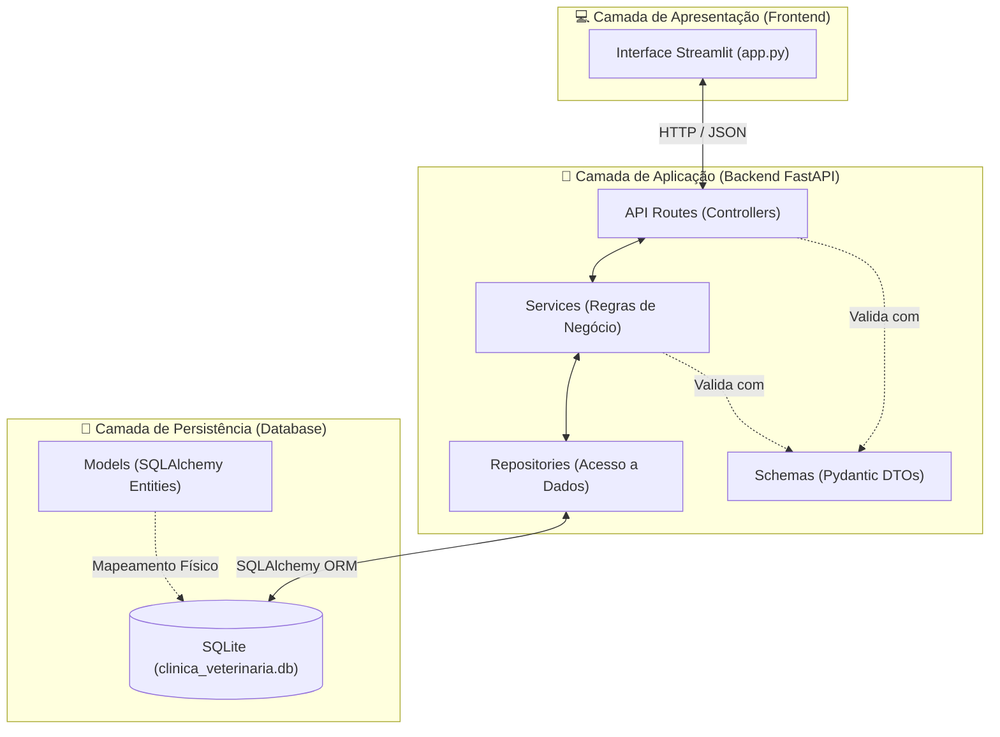

# 🏗️ Arquitetura do Sistema — MedPet

## 1. Visão Geral da Arquitetura

O sistema **MedPet** é projetado seguindo o modelo **Cliente-Servidor** descentralizado, utilizando uma stack unificada em Python. A separação clara entre a interface e as regras de persistência/negócio é estabelecida através de requisições HTTP RESTful com mensagens estruturadas em JSON.

---

## 2. Divisão de Responsabilidades (Diretórios do Backend)

Para manter o código modular e de fácil manutenção, a estrutura de diretórios do backend divide as funções de forma explícita:

| Diretório / Arquivo | Camada | Papel Principal | Exemplo de Implementação |
| :--- | :--- | :--- | :--- |
| [`app/models/`](file:///c:/Users/guilh/OneDrive/Área%20de%20Trabalho/MedPet/backend/app/models) | Model | Mapeamento direto de tabelas físicas no banco via SQLAlchemy. | `usuario.py` (Campos e constraints SQL) |
| [`app/schemas/`](file:///c:/Users/guilh/OneDrive/Área%20de%20Trabalho/MedPet/backend/app/schemas) | DTO (Data Transfer) | Contratos de validação de dados usando Pydantic. | `cliente_schema.py` (Campos de input/output) |
| [`app/repositories/`](file:///c:/Users/guilh/OneDrive/Área%20de%20Trabalho/MedPet/backend/app/repositories) | Data Access | Queries isoladas e operações de persistência no SQLite. | `pet_repository.py` (`get_by_id`, `create`) |
| [`app/services/`](file:///c:/Users/guilh/OneDrive/Área%20de%20Trabalho/MedPet/backend/app/services) | Business logic | Validações de negócio, encriptação e regras de domínio. | `auth_service.py` (Autenticação JWT) |
| [`app/routes/`](file:///c:/Users/guilh/OneDrive/Área%20de%20Trabalho/MedPet/backend/app/routes) | Controller | Endpoints HTTP, mapeamento de status codes e injeção do DB. | `usuario_routes.py` (Endpoints de usuários) |
| [`app/core/`](file:///c:/Users/guilh/OneDrive/Área%20de%20Trabalho/MedPet/backend/app/core) | Core & Config | Configurações do sistema, chaves criptográficas e segurança. | `security.py` (Criação de tokens JWT) |

---

## 3. Padrões de Projeto Aplicados

A arquitetura do MedPet faz uso de quatro padrões fundamentais de desenvolvimento corporativo:

### 3.1. Repository Pattern (Padrão Repositório)
Isola o acesso a dados de forma que a camada de serviços não precise conhecer detalhes da biblioteca de ORM ou do banco de dados subjacente.
* **Vantagem**: Se no futuro decidirmos mudar do SQLite para o PostgreSQL, alteramos apenas os Repositórios; a lógica nos Services continuará intacta.

### 3.2. Service Layer (Camada de Serviço)
Centraliza a lógica de domínio do negócio, mantendo os controladores (routes) finos e focados unicamente no protocolo HTTP.
* **Vantagem**: Facilita a escrita de testes unitários isolados, simulando apenas as validações sem passar por requisições HTTP complexas.

### 3.3. Dependency Injection (Injeção de Dependência)
Utilizado de forma nativa pelo FastAPI através da cláusula `Depends`. Ele injeta a sessão de banco de dados (`Session`) e as verificações de token de segurança.

> [!TIP]
> **Facilidade nos Testes:**
> A injeção de dependência via `Depends(get_db)` do FastAPI permite que nos testes automatizados (`tests/conftest.py`) possamos sobrescrever (`app.dependency_overrides`) o banco de dados do sistema real por um banco SQLite em memória (`sqlite:///:memory:`), rodando testes de forma rápida e segura.

### 3.4. DTO (Data Transfer Object)
Implementado utilizando as classes do **Pydantic Schemas**. Define exatamente a estrutura de dados que entra e sai da API, impedindo o vazamento de informações confidenciais.
* **Exemplo prático**: O schema `UsuarioResponse` não possui o campo `senha_hash`, garantindo que o backend nunca devolva o hash das senhas dos operadores para o frontend nas listagens.
