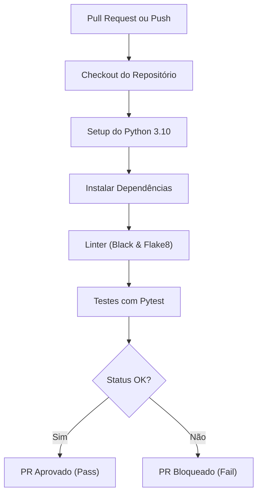

# ⚙️ Integração Contínua (CI/CD) — MedPet

Este documento detalha o pipeline de Integração Contínua (CI) automatizado do **MedPet** via **GitHub Actions**.

---

## 1. Funcionamento Geral do Pipeline

Toda alteração enviada ao repositório remoto passa por uma série de verificações automatizadas de qualidade de código, sintaxe e conformidade, antes de ser disponibilizada para integração.

O arquivo de workflow está localizado em:
`.github/workflows/ci.yml`



---

## 2. Gatilhos de Execução

O workflow é executado nas seguintes ramificações (`branches`):
* **`main` / `master`**: Execução direta no `push` ou em `pull_request` destinados a elas.
* **`develop`**: Ramificação principal de integração local das features dos membros da equipe.

---

## 3. Etapas Detalhadas do Job (`test`)

A esteira roda em ambiente virtualizado com **Ubuntu** (`ubuntu-latest`) e executa as seguintes etapas:

### 3.1. Instalação do Ambiente e Dependências
1. **Checkout**: Clona o código da branch no Runner temporário do GitHub.
2. **Setup Python**: Configura o interpretador Python 3.10 com cache ativo do gerenciador `pip` (otimizando a velocidade das próximas builds).
3. **Instalação**: Instala as dependências de execução do backend e de ferramentas de desenvolvimento:
   ```bash
   pip install -r backend/requirements.txt
   pip install -r requirements-dev.txt
   ```

### 3.2. Validação Estática de Estilo (Linter)
* **Black (Check Mode)**: Verifica se o código atende às especificações de formatação padrão PEP 8.
  ```bash
  black --check backend/app tests/
  ```
* **Flake8**: Detecta erros de sintaxe graves ou importações inválidas que não estão em uso no código.
  ```bash
  flake8 backend/app tests/ --count --select=E9,F63,F7,F82 --show-source --statistics
  ```

### 3.3. Execução da Suíte de Testes
* Executa o `pytest` apontando a variável `PYTHONPATH` para a pasta do backend:
  ```bash
  pytest tests/
  ```

---

## 4. Proteção de Branch e Fusão (Merge)

> [!IMPORTANT]
> **Políticas de Qualidade e Bloqueio de Código**
> Para garantir que código instável ou sem testes nunca chegue às ramificações principais, as regras do GitHub estão configuradas para exigir:
> 1. Execução bem-sucedida do pipeline de CI (`CI Pipeline / test`).
> 2. Pelo menos um Code Review e aprovação de outro membro do grupo.
> 3. Bloqueio automático de fusão (Merge) caso qualquer teste ou linter do pipeline acuse erro.
