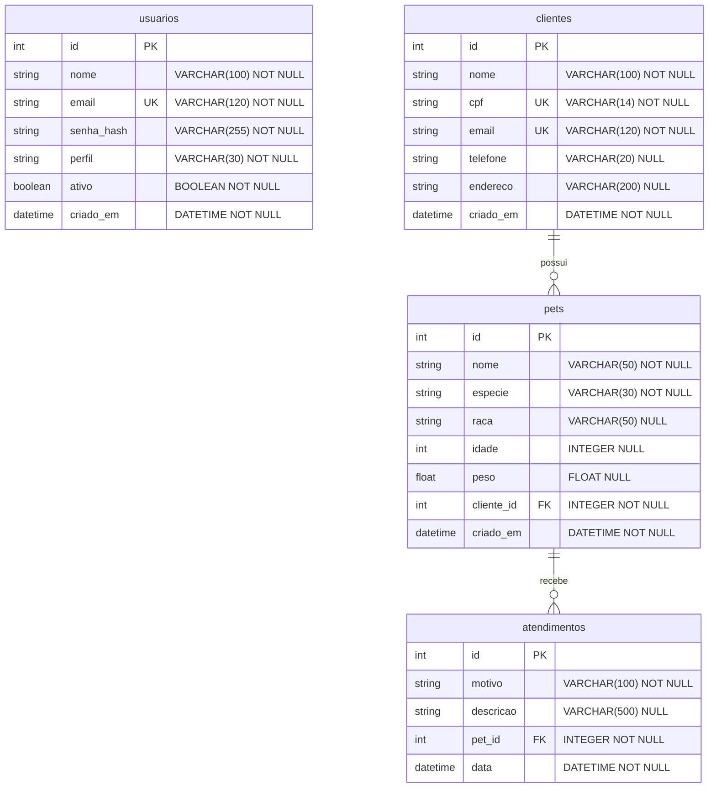

# 🗄️ Modelo de Dados — MedPet

Este documento especifica o esquema lógico e físico das tabelas do banco de dados relacional do **MedPet**, descrevendo colunas, tipos, chaves, restrições e integridade.

---

## 1. Banco de Dados

* **Motor**: SQLite (versão 3)
* **Arquivo**: `clinica_veterinaria.db` (gerado na pasta `backend/` na inicialização da API)
* **Mecanismo ORM**: SQLAlchemy (mapeamento declarativo em classes Python)

---

## 2. Diagrama Entidade-Relacionamento (ERD)

Os relacionamentos refletem a lógica de negócios da clínica: um tutor (Cliente) possui pets, e cada pet possui um histórico de consultas (Atendimentos).

---

## 3. Dicionário de Dados (Tabelas)

### 3.1. Tabela: `usuarios`
Registra as credenciais de acesso dos operadores habilitados a interagir com a aplicação.

| Coluna | Tipo Físico | Restrições | Padrão | Descrição |
| :--- | :--- | :--- | :--- | :--- |
| `id` 🔑 | INTEGER | `PRIMARY KEY`, `AUTOINCREMENT` | | Identificador incremental e exclusivo. |
| `nome` | VARCHAR(100) | `NOT NULL` | | Nome de exibição do operador. |
| `email` 🌐 | VARCHAR(120) | `UNIQUE`, `NOT NULL`, `INDEX` | | E-mail para autenticação. |
| `senha_hash` | VARCHAR(255) | `NOT NULL` | | Hash gerado com o algoritmo **bcrypt**. |
| `perfil` | VARCHAR(30) | `NOT NULL` | `'atendente'` | Papel de acesso (`'administrador'`, `'atendente'`, `'veterinario'`). |
| `ativo` | BOOLEAN | `NOT NULL` | `True` | Define se o operador está habilitado a logar. |
| `criado_em` | DATETIME | `NOT NULL` | `CURRENT_TIMESTAMP` | Data e hora automática do cadastro. |

---

### 3.2. Tabela: `clientes`
Armazena dados cadastrais dos tutores responsáveis pelos animais.

| Coluna | Tipo Físico | Restrições | Padrão | Descrição |
| :--- | :--- | :--- | :--- | :--- |
| `id` 🔑 | INTEGER | `PRIMARY KEY`, `AUTOINCREMENT` | | Código identificador do tutor. |
| `nome` | VARCHAR(100) | `NOT NULL` | | Nome completo do cliente. |
| `cpf` 🌐 | VARCHAR(14) | `UNIQUE`, `NOT NULL`, `INDEX` | | CPF formatado (`000.000.000-00`). |
| `email` 🌐 | VARCHAR(120) | `UNIQUE`, `NOT NULL`, `INDEX` | | E-mail para contato e avisos. |
| `telefone` | VARCHAR(20) | `NULL` | | Telefone principal de contato. |
| `endereco` | VARCHAR(200) | `NULL` | | Endereço residencial para prontuário. |
| `criado_em` | DATETIME | `NOT NULL` | `CURRENT_TIMESTAMP` | Data e hora automática do cadastro. |

---

### 3.3. Tabela: `pets`
Cadastra e detalha os animais de estimação sob cuidados da clínica.

| Coluna | Tipo Físico | Restrições | Padrão | Descrição |
| :--- | :--- | :--- | :--- | :--- |
| `id` 🔑 | INTEGER | `PRIMARY KEY`, `AUTOINCREMENT` | | Código identificador do pet. |
| `nome` | VARCHAR(50) | `NOT NULL` | | Nome de chamada do animal. |
| `especie` | VARCHAR(30) | `NOT NULL` | | Espécie (`'Cachorro'`, `'Gato'`, etc.). |
| `raca` | VARCHAR(50) | `NULL` | | Raça do pet. |
| `idade` | INTEGER | `NULL` | | Idade declarada em anos. |
| `peso` | FLOAT | `NULL` | | Peso em quilogramas (kg). |
| `cliente_id` 🔗 | INTEGER | `FOREIGN KEY` -> `clientes.id`, `NOT NULL` | | Código associado ao tutor do animal. |
| `criado_em` | DATETIME | `NOT NULL` | `CURRENT_TIMESTAMP` | Data e hora do cadastro do pet. |

---

### 3.4. Tabela: `atendimentos`
Registra o histórico de prontuários clínicos e atendimentos de cada animal.

| Coluna | Tipo Físico | Restrições | Padrão | Descrição |
| :--- | :--- | :--- | :--- | :--- |
| `id` 🔑 | INTEGER | `PRIMARY KEY`, `AUTOINCREMENT` | | Código único do atendimento. |
| `motivo` | VARCHAR(100) | `NOT NULL` | | Tipo de serviço (`'Consulta'`, `'Vacina'`, `'Cirurgia'`). |
| `descricao` | VARCHAR(500) | `NULL` | | Detalhamento clínico e medicamentos. |
| `pet_id` 🔗 | INTEGER | `FOREIGN KEY` -> `pets.id`, `NOT NULL` | | Código do pet atendido. |
| `data` | DATETIME | `NOT NULL` | `CURRENT_TIMESTAMP` | Data e hora da consulta clínica. |

---

## 4. Regras de Integridade Referencial

### Integridade Referencial e Comportamento de Cascata

> [!WARNING]
> **Políticas de Cascade Delete (`ON DELETE CASCADE`)**
> 1. **Remoção de Cliente:** Caso um **Cliente** seja excluído, a regra `cascade="all, delete-orphan"` no relacionamento garante que todos os seus **Pets** associados sejam permanentemente removidos.
> 2. **Remoção de Pet:** Caso um **Pet** seja excluído, todos os seus respectivos **Atendimentos** clínicos registrados no histórico são apagados em cadeia para prevenir registros órfãos.

### Regras de Validação no Banco de Dados
- **Chaves Únicas (UK)**:
  - Não é permitida a duplicação do `cpf` ou do `email` na tabela `clientes`.
  - Não é permitida a duplicação do `email` na tabela `usuarios`.
